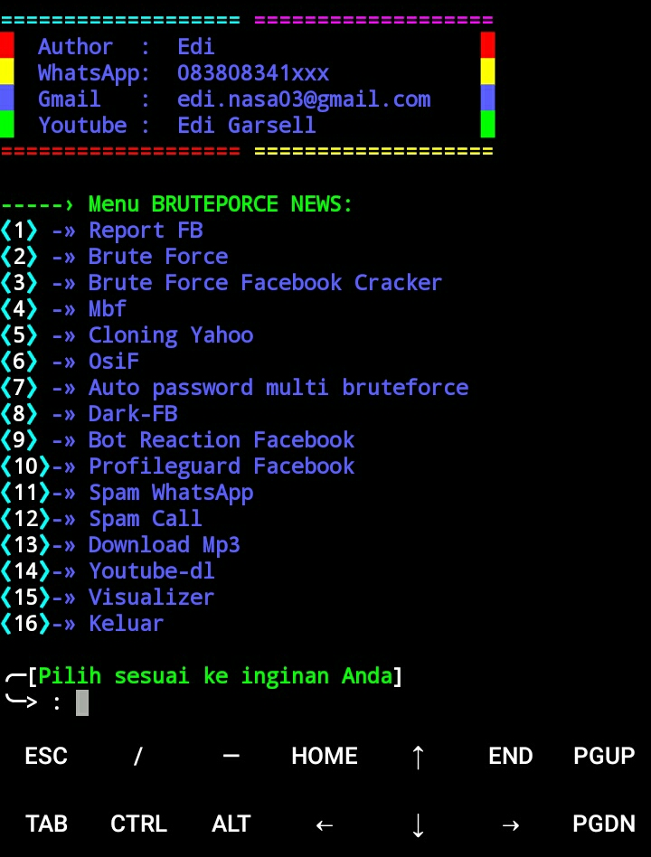

# Instalasi:

```
$ pkg update && pkg upgrade
$ pkg install git
$ pkg install python2
$ pip2 install mechanize
$ git clone https://github.com/MEiZU-M5/edi.git
$ cd edi
$ sh 1.sh
```

# Screenshot


# Follow Facebook:
👉 https://www.facebook.com/edi.garsella

# Jangan Lupa Subcribe Video Channel Kami:
👉 https://www.youtube.com/channel/UCr1X7uS9_FEjITKDah2FxXw

